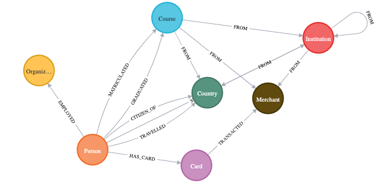

# **KG Game Neo4j**

This repository contains the Cypher queries for the Knowledge Graph game designed for the first time Neo4j Graph technology users to follow along with the demo and better understand the concepts of Knowledge Graphs and Neo4j.

For this we have prepared a small [dataset](./data/) covering the following topics:

- [Education](./data/sng_education.csv)
- [Employment](./data/sng_work.csv)
- [Travel](./data/sng_trips.csv)
- [Bank Card Transactions](./data/sng_work.csv)

 
In this demo we will be covering the following Neo4j Graph usages:

- Data Ingestion [Neo4j Browser]
- Data Exploration [Neo4j Browser]
- Graph Traversals [Neo4j Browser]
- Visaul Graph Exploration [Neo4j Bloom]

#### _Graph data model used in this demo_

You can follow along with the demo (_if you're attending one of our workshops or you can run this by yourself_) by running the queries in the `cypher_scripts/workshop_cypher_query.cql` file and setting up a Neo4j Database using the following link to set up a free hosted Neo4j Aura instance:

- [Neo4j Aura - Free](https://neo4j.com/cloud/aura/)

 
> Happy Traversing! 🖖🏾🙂
